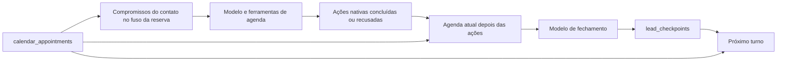

# Agenda no contexto e no fechamento do agente

A reserva persistida em `calendar_appointments` é a fonte de data, hora e situação.
O resumo do contato conserva a conversa; não substitui a consulta da agenda.

## Contratos

- `compromissos-do-contato.ts` mantém o recorte por organização, contato,
  compromissos não cancelados e término futuro. Exibe a hora local com o fuso
  da reserva e o mesmo instante em ISO com offset. O teto continua em cinco;
  o aviso de truncamento e a situação de Google Meet permanecem.
- `crm_list_appointments` e os resultados de escrita de agenda incluem rótulos
  locais. Os campos absolutos usados para executar as ações são preservados.
  Uma recusa de negócio continua sendo recusa, inclusive quando o transporte
  da ferramenta termina com sucesso.
- `agendaNoFechamento` relê depois das ferramentas se a abertura tinha reservas
  ou se o turno usou uma ferramenta de agenda. Não acrescenta chamada ao
  modelo. Não faz essa leitura para propostas de prévia ainda não executadas.
- O fechamento usa `result.responseMessages`, a fita completa de todas as
  etapas. `result.response.messages` contém apenas a última etapa no SDK atual
  e pode omitir justamente a marcação feita antes do envio. As partes de
  ferramenta dessa fita chegam ao fechamento como TEXTO (`toolPartsAsText`, em
  `prune-tool-results.ts`): a chamada de fechamento vai sem `tools`, e a API da
  Anthropic recusa tool_use/tool_result sem tools definidas. Cada resultado tem
  teto em `PRUNE_TOOL_RESULTS_MIN_RESULT_TOKENS`.
- O fechamento recebe a nova leitura e a orientação de substituir fatos
  superados, preservando pedidos e preferências. Uma lista vazia significa
  ausência de compromissos ativos e futuros nesse recorte, não agenda livre.
- Falha da releitura é registrada como desconhecimento. Não vira lista vazia
  nem provoca repetição de uma mensagem já enviada. O modelo ainda redige
  o resumo: esta mudança melhora suas fontes, não valida toda frase gerada.

## Alcance e limites

Os escritores, permissões, isolamento, confirmação humana, distribuição de
atendimento e integrações externas não mudam. Não há configuração nova nem
alteração de banco. A atividade e os eventos continuam vindo dos escritores
nativos; o resumo não executa nem desfaz uma reserva.

Testes reproduzíveis:

- `tests/unit/agenda-horarios-locais-no-turno.test.ts`: fusos, horário de verão,
  releitura, ausência de reserva e falha da consulta.
- `tests/unit/mcp-escrita-de-agenda-tem-horario-local.test.ts`: contrato local
  dos resultados e conservação de recusas, situação e instantes.
- `tests/invariants/agenda-atual-no-fechamento.test.ts`: motor completo com
  PostgreSQL descartável, alteração durante o turno e checkpoint persistido.
  Usa dublê de modelo; não mede a semântica de um provedor real.
