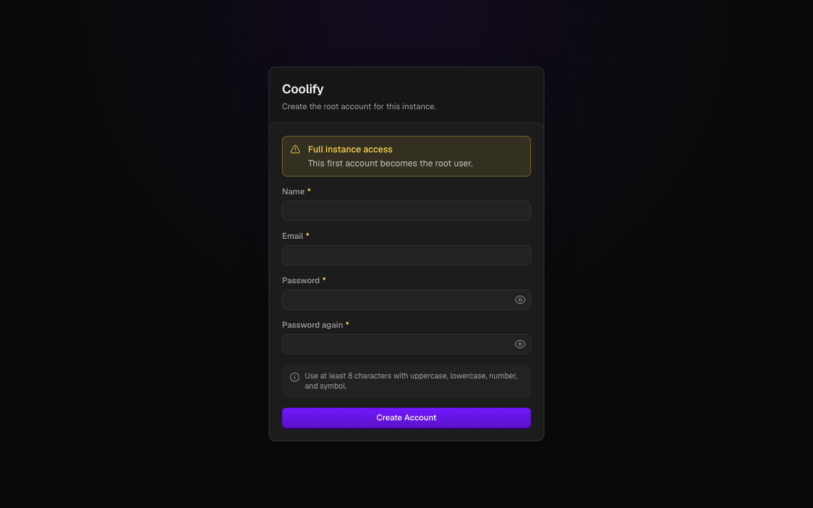
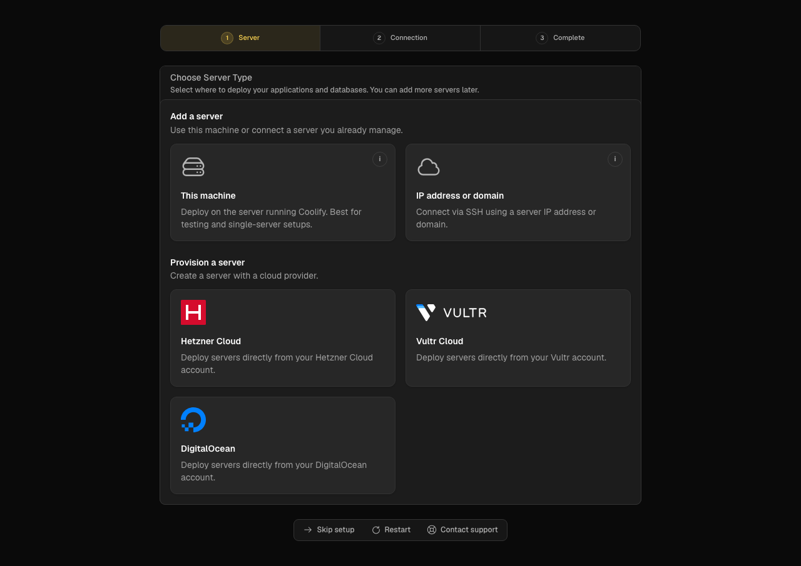
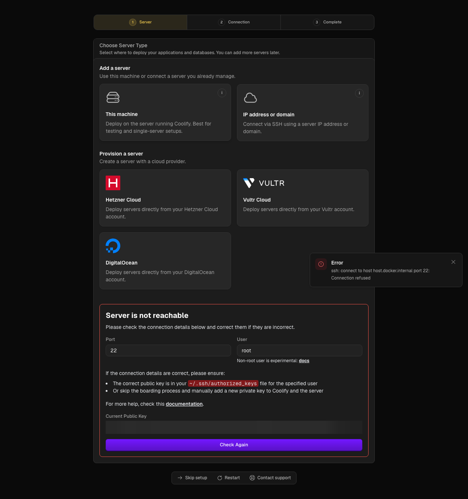
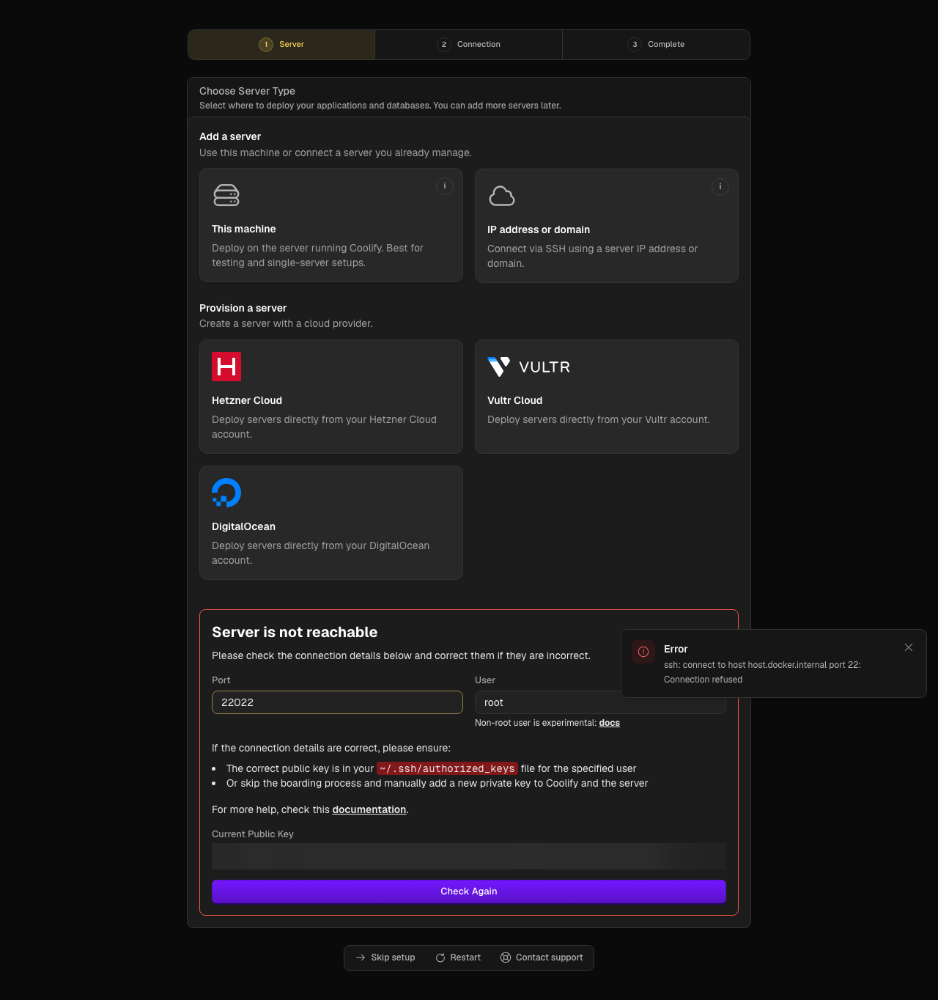
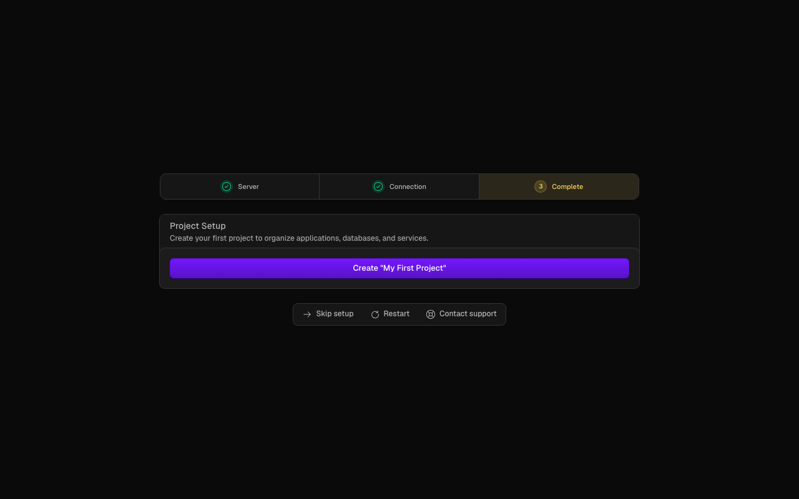
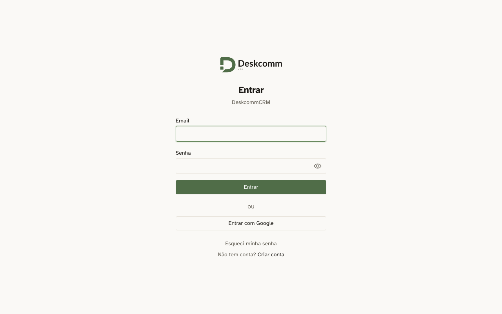
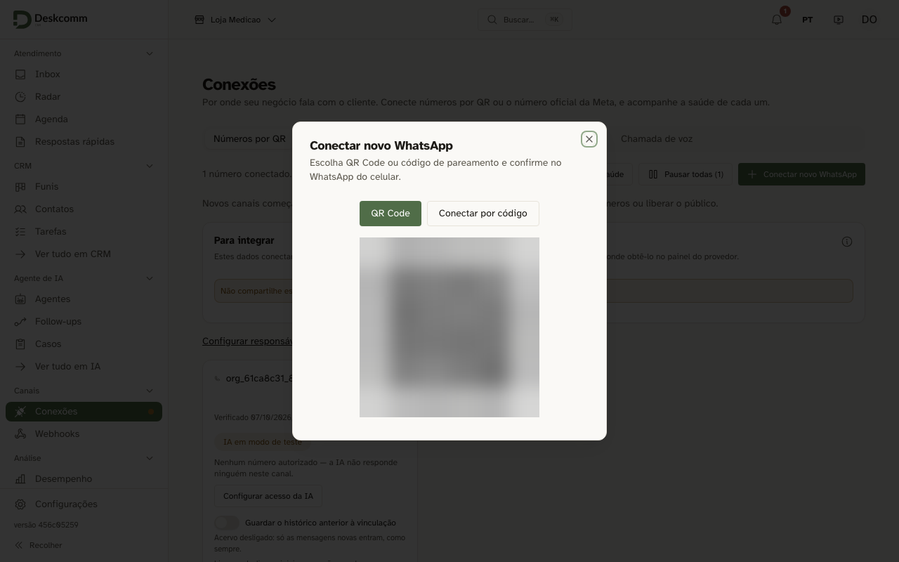
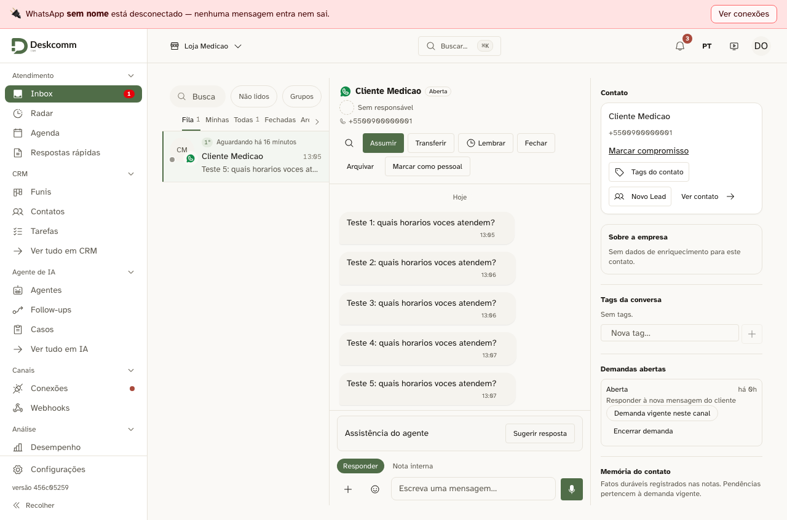
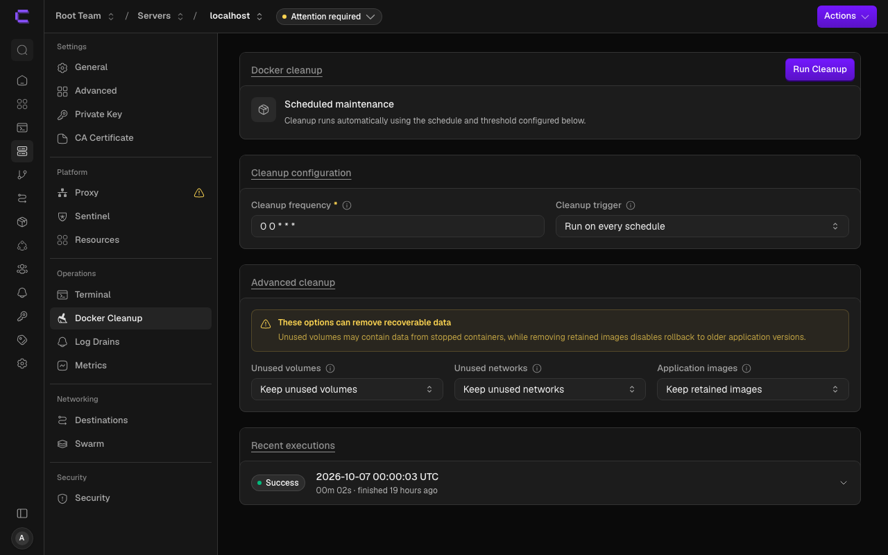

# Instalar o DeskcommCRM numa VPS com Coolify

Este guia é para quem tem uma VPS (testado na HostGator) e quer usar o **Coolify** nela. No
fim, o CRM **e o banco de dados dele** estarão rodando na mesma VPS, atrás do proxy do
Coolify, com o seu domínio e o cadeado do HTTPS.

Quem instala o CRM e o banco é o **instalador do kit**, por um comando no terminal da VPS,
e não o painel do Coolify. O Coolify fica com o papel de porteiro: é o proxy dele que
recebe as visitas do seu domínio e as entrega ao CRM.

Sem Coolify, use o guia [Deploy na HostGator](../deploy-hostgator/README.md): é mais curto.

Tudo o que este guia afirma foi medido numa VPS de teste da HostGator em 06 e 07/10/2026.
As provas estão em [`evidence/2026-10-07-coolify-consumo/`](../../evidence/2026-10-07-coolify-consumo/README.md).
O que não foi medido está escrito como "não medido nesta versão".

## Quando usar o Coolify

Use o Coolify quando a VPS **também vai hospedar outros sistemas** (um site, uma
automação, outro app) e você quer gerenciá-los por um painel.

Se a VPS for só do CRM, o instalador sozinho (o guia sem Coolify, acima) é mais leve: o
Coolify e o proxy dele ocupam, em repouso, cerca de **506 MiB de memória** (MiB e GiB são as unidades de memória que o Linux usa;
1 GiB ≈ 1,07 GB) (medido; ver
[Quanto a VPS precisa](#quanto-a-vps-precisa-medido)).

## Antes de começar

Confira esta lista. Cada item diz onde conseguir.

- **Um computador com terminal.** Mac: o app Terminal. Windows: o PowerShell.
- **Os dados da VPS**, no painel da HostGator: o IP, a porta SSH `22022` e a senha do root
  (ou a sua chave pública cadastrada lá).
- **Um domínio seu**, com acesso ao painel de DNS. Se o DNS for no Cloudflare, a nuvem do
  registro precisa ficar **cinza**.
- **Memória (RAM): 8 GB.** É o tamanho que a medição sustenta para o CRM, o banco e o
  Coolify juntos (a conta está em [Quanto a VPS precisa](#quanto-a-vps-precisa-medido)).
  Na medição, a máquina inteira usou no máximo cerca de 2,7 GiB (2815 MiB) durante a
  conversa de teste; **uma VPS de 4 GB não foi medida**. Numa VPS com bem menos de 4 GB o
  instalador nem começa: ele para com "O modo single-server exige pelo menos 4 GB de RAM e recomenda 8 GB."
- **Disco:** as 11 imagens do banco ocupam cerca de 9,1 GB depois de baixadas. Na VPS de
  teste, todas as imagens do Docker somavam 19,84 GB, mas essa conta inclui o Coolify e
  outros testes que rodavam na mesma máquina. O banco, com os anexos, depois de criar a
  conta e uma conversa de teste, ocupava 105 MiB. Deixe espaço também para os backups (o kit guarda os 14 mais recentes).
- **Tempo:** a instalação do Coolify levou menos de 1 minuto na VPS medida; a do CRM com o banco, 2 min 44 s na
  primeira vez (baixando tudo). Some uns 15 minutos de cliques e esperas (estimativa, não
  cronometrada) e o tempo que o DNS leva para propagar.
- **Não precisa de conta no Supabase.** O banco é instalado na própria VPS.

**Sua VPS já veio com Coolify?** Rode `docker inspect -f '{{.Config.Image}}' coolify` na
VPS. Se a resposta não terminar em `:4.3.23`, as telas podem estar diferentes das deste
guia. Desligue a atualização automática do Coolify nas configurações dele (o caminho na
tela não foi conferido nesta versão) e pule para o [Passo 3](#passo-3--criar-o-admin-e-fechar-o-painel).

**Alternativa: banco no Supabase Cloud (não medida com Coolify nesta versão).** Em vez do
Passo 5, dá para rodar `TRAEFIK_NETWORK=coolify bash hostgator-setup-kit/install.sh` e
responder com as chaves de um projeto do Supabase Cloud (o
[README do kit](../../hostgator-setup-kit/README.md) ensina a pegá-las; use a conexão
**Session pooler**, nunca a Direct). Isso gasta menos memória na VPS e tira o banco de lá,
mas depende de mais uma conta. Esse caminho **não foi medido com Coolify** nesta versão.

## Passo 0 — Entrar na sua VPS

No terminal do seu computador:

```bash
ssh -p 22022 root@SEU-IP
```

Troque `SEU-IP` pelo IP da sua VPS. Todos os comandos dos próximos passos rodam **dentro
da VPS**, nesta janela, a menos que o passo diga outra coisa. Isso vale também para as
conferências com `curl`: o `curl` do PowerShell do Windows é outro programa e responde
diferente.

**Você vai ver:** na primeira vez, o terminal pode perguntar "Are you sure you want to
continue connecting" (digite `yes` e Enter). Depois, ele pode pedir a senha. Enquanto você digita a senha, nada
aparece na tela: é assim mesmo.

**Se der errado:**

- "Connection timed out" ou "Connection refused" → faltou o `-p 22022`. Na VPS medida, a
  porta 22 estava fechada.
- `Permission denied (publickey,password).` → a senha não foi aceita. Redefina a senha do
  root no painel da HostGator, ou crie uma chave no seu computador (`ssh-keygen -t ed25519`,
  depois `cat ~/.ssh/id_ed25519.pub`) e cole o resultado no painel.
- "REMOTE HOST IDENTIFICATION HAS CHANGED" depois de reinstalar a VPS → rode no seu
  computador `ssh-keygen -R "[SEU-IP]:22022"`, com os colchetes e as aspas (sem eles o
  comando não acha a entrada), ou o comando que a própria mensagem mostra.

## Passo 1 — Apontar o domínio

Faça isto **antes** de instalar, porque a propagação demora e o cadeado (o certificado do
HTTPS) só sai quando o domínio já aponta para a VPS.

No painel de DNS do seu domínio, crie um registro **A** com o nome `crm` apontando para o
IP da VPS. No Cloudflare, deixe a nuvem **cinza**.

Para conferir, no terminal:

```bash
nslookup crm.SEUDOMINIO.com.br
```

**Você vai ver:** o IP da sua VPS na resposta.

**Se der errado:**

- IP diferente ou "can't find" → espere alguns minutos e confira de novo.
- Com a nuvem **laranja** no Cloudflare, o IP nunca bate com o da VPS → troque para cinza.

## Passo 2 — Instalar o Coolify

```bash
curl -fsSL https://cdn.coollabs.io/coolify/install.sh -o coolify-install.sh && AUTOUPDATE=false bash coolify-install.sh 4.3.23
```

O `4.3.23` é a versão medida neste guia. O `AUTOUPDATE=false` impede o Coolify de se
atualizar sozinho (se ele mudar de versão, as telas deste guia mudam junto). Ele fixa só o
Coolify, não os auxiliares dele: o Sentinel, um agente de métricas que vem ligado de
fábrica, apareceu em duas versões no disco da VPS medida (como ele trocou de versão não
foi medido).

**Você vai ver:** no fim, "Your instance is ready to use!" e o endereço
`http://SEU-IP:8000`. Na VPS medida, a instalação levou menos de 1 minuto.

**Crie o admin AGORA, no Passo 3, antes de qualquer outra coisa.** Na VPS medida, o
endereço `http://SEU-IP:8000` abria **para a internet inteira**, e quem abre essa tela
primeiro vira dono do painel. Em outros provedores essa porta pode chegar bloqueada; o
túnel do Passo 3 funciona nos dois casos.

**Se der errado:**

- A conexão caiu no meio → entre de novo (Passo 0) e rode o mesmo comando (não medido
  nesta versão).

## Passo 3 — Criar o admin e fechar o painel

**1. Abra o túnel.** Num **segundo** terminal do seu computador (deixe o primeiro aberto):

```bash
ssh -p 22022 -N -L 8000:localhost:8000 -L 6001:localhost:6001 -L 6002:localhost:6002 root@SEU-IP
```

Depois abra `http://localhost:8000` no navegador. O túnel leva o painel do Coolify até o
seu computador sem expô-lo para a internet.

**2. Crie o admin.** Na tela de registro, preencha nome, e-mail e senha e clique em
**Create Account**. Guarde a senha num gerenciador de senhas.



**3. Comece o assistente.** Clique em **Continue** e, na escolha do servidor, em **This
machine** (o próprio servidor onde o Coolify roda).



Deixe o navegador como está; volte a ele no Passo 4.

**4. Feche o painel para fora, de forma permanente.** De volta ao primeiro terminal (o da
VPS), cole o bloco inteiro abaixo. Ele cria uma regra que barra o acesso de fora às portas
do painel (8000, 6001 e 6002) e a reaplica sempre que a VPS liga. O painel continua
abrindo pelo túnel. (O firewall `ufw` não serve aqui: ele não filtra as portas que o
Docker publica.)

```bash
cat > /usr/local/sbin/deskcomm-fecha-painel.sh <<"FIM"
#!/bin/sh
# Fecha para fora as portas do painel do Coolify (8000, 6001, 6002). O painel
# continua acessível pelo túnel SSH. DOCKER-USER, e não ufw: o ufw não filtra
# porta publicada pelo Docker.
IF=$(ip -o route get 1.1.1.1 | sed -n "s/.* dev \([^ ]*\).*/\1/p")
for p in 8000 6001 6002; do
  iptables -C DOCKER-USER -i "$IF" -p tcp -m conntrack --ctorigdstport "$p" --ctdir ORIGINAL -j DROP 2>/dev/null \
    || iptables -I DOCKER-USER -i "$IF" -p tcp -m conntrack --ctorigdstport "$p" --ctdir ORIGINAL -j DROP
done
# IPv6: a rede coolify nasce com IPv6 ligado e o Docker publica [::]:8000.
# Sem estas, numa VPS com IPv6 global o painel ficaria aberto por ele.
for p in 8000 6001 6002; do
  ip6tables -C DOCKER-USER -i "$IF" -p tcp -m conntrack --ctorigdstport "$p" --ctdir ORIGINAL -j DROP 2>/dev/null \
    || ip6tables -I DOCKER-USER -i "$IF" -p tcp -m conntrack --ctorigdstport "$p" --ctdir ORIGINAL -j DROP
done
FIM
chmod 755 /usr/local/sbin/deskcomm-fecha-painel.sh
cat > /etc/systemd/system/deskcomm-fecha-painel.service <<"FIM"
[Unit]
Description=Fecha para fora o painel do Coolify (8000, 6001, 6002)
After=docker.service
Requires=docker.service

[Service]
Type=oneshot
RemainAfterExit=yes
ExecStart=/usr/local/sbin/deskcomm-fecha-painel.sh

[Install]
WantedBy=multi-user.target
FIM
systemctl daemon-reload && systemctl enable --now deskcomm-fecha-painel.service && iptables -S DOCKER-USER | grep -c ctorigdstport; ip6tables -S DOCKER-USER | grep -c ctorigdstport
```

**Você vai ver:** a janela do túnel fica parada, sem mostrar nada: é assim mesmo, deixe-a
aberta enquanto usa o painel. No navegador, a tela de registro e depois o assistente.
Depois do bloco de fechamento, dois números: `3` e `3` (três portas fechadas no IPv4 e três
no IPv6, os dois tipos de endereço da internet).
Para conferir, abra `http://SEU-IP:8000` no navegador do seu computador, sem o túnel: a
página não carrega mais. Pelo túnel (`http://localhost:8000`), abre. Na VPS medida, este
bloco deu `3` e `3`; de fora, as portas 8000, 6001 e 6002 ficaram fechadas, e pelo túnel o
painel abriu.
A regra continua valendo depois de reiniciar a VPS (medido: depois do reboot, as seis regras
voltaram sozinhas e as portas do painel seguiram fechadas de fora). O fechamento pelo IPv6 foi aplicado,
mas **não foi medido de fora** (a VPS de teste não tinha IPv6 público).

**Se der errado:**

- `bind: Address already in use` no túnel → o seu computador já usa a porta 8000. Troque
  `-L 8000:` por `-L 8080:` e abra `http://localhost:8080`.
- A página não carrega pelo túnel → o túnel caiu. Rode o comando do túnel de novo.
- `http://SEU-IP:8000` ainda abre de fora depois do bloco → rode o bloco de novo e confira
  os dois números.

## Passo 4 — Ligar o proxy do Coolify

O assistente tenta falar com a própria VPS pela porta SSH padrão, a 22. Na HostGator a
porta é a 22022, então ele mostra a caixa **"Server is not reachable"** com **Port** `22`,
e um aviso de erro com "Connection refused".



Na própria caixa, troque **Port** para `22022` e clique em **Check Again**.



O assistente marca **Server** e **Connection** como concluídos e chega a **Complete**.
Clique em **Skip setup**, embaixo. Ele encerra o assistente sem criar projeto: este guia
não usa projetos do Coolify. O clique medido foi na tela "Welcome to Coolify"; se ele
aparecer na tela "Complete", funciona igual (não medido).



Não é preciso clicar em nada para ligar o proxy: na VPS medida ele **subiu sozinho** cerca
de 3 a 4 minutos depois do Check Again. Para conferir, na VPS:

```bash
docker ps --filter name=coolify-proxy --format '{{.Names}} {{.Status}}'
```

**Você vai ver:** `coolify-proxy Up …` (com `(healthy)` no fim). Enquanto não aparecer
nada, espere mais um pouco e rode de novo.

**Não rode o instalador (Passo 5) com o proxy parado.**

**Se der errado:**

- Depois do Check Again a caixa continua "Server is not reachable" → confira se digitou
  `22022` mesmo e clique em Check Again de novo.
- Passaram 10 minutos e o comando não mostra `coolify-proxy` → não medido nesta versão
  (na VPS de teste ele sempre subiu sozinho). Abra Servers › localhost › Proxy no painel e
  veja o que ele diz.

## Passo 5 — Instalar o CRM e o banco

Na VPS, baixe o CRM e entre na pasta:

```bash
cd ~ && git clone --depth 1 https://github.com/melgarafael/DeskcommCRM.git deskcommcrm && cd deskcommcrm
```

Agora rode o instalador **com todas as variáveis**, trocando só o domínio no fim. Copie o
bloco inteiro:

```bash
REVERSE_PROXY=traefik \
TRAEFIK_NETWORK=coolify \
TRAEFIK_ENTRYPOINT=https \
TRAEFIK_ENTRYPOINT_HTTP=http \
API_GW_HTTP_PORT=8001 \
bash hostgator-setup-kit/install-single-server.sh --domain crm.SEUDOMINIO.com.br
```

O que cada linha diz ao instalador:

- `REVERSE_PROXY=traefik`: quem publica o site é o proxy do Coolify (um Traefik), e não o
  proxy próprio do kit.
- `TRAEFIK_NETWORK=coolify`: o nome da rede onde o proxy do Coolify mora. Sem ela, numa VPS
  com outros apps, o instalador pode escolher a rede de outro app (medido).
- `TRAEFIK_ENTRYPOINT=https` e `TRAEFIK_ENTRYPOINT_HTTP=http`: os nomes que o proxy do
  Coolify dá às portas 443 e 80.
- `API_GW_HTTP_PORT=8001`: o banco usa a porta 8001 da VPS, porque a 8000 é do painel do
  Coolify.

O instalador não faz perguntas: o domínio já vai no comando.

**Você vai ver**, nesta ordem (trecho):

```
▶ Preparando o Supabase self-hosted self-hosted/v0.8.1
===> Setup starting in /root/deskcommcrm
===> Generating secrets and legacy API keys
===> Generating asymmetric key pair and opaque API keys
===> Pulling Docker images
▶ Subindo o Supabase local
▶ Configurando o CRM sem perguntas adicionais
✓ Supabase desta VPS: os e-mails de acesso já usam os moldes do app (gravados no GoTrue).
✓ dono criado e promovido a super-admin
✓ containers no ar
✓ app no ar e saudável

Credenciais iniciais (arquivo protegido com permissao 600):
  usuario: admin@crm.SEUDOMINIO.com.br
  senha:   (uma senha longa, gerada agora)
  arquivo: /root/deskcommcrm/.runtime/admin-credentials
```

As chaves do banco **não aparecem na tela**: o instalador as guarda em
`.runtime/supabase-setup.log`, um arquivo que só o root lê. Não compartilhe esse arquivo.

A linha dos e-mails de acesso é a do kit atual (#2574, provada por teste). Na instalação
medida, anterior a esse conserto, aparecia no lugar dela um aviso `⚠ sem SUPABASE_ACCESS_TOKEN`,
que não se aplicava ao banco na própria VPS. O aviso com `⚠` sobre o separador `&` apareceu em
todas as instalações medidas e não impediu nada. No fim também aparece um aviso de que, sem
SMTP (o servidor que envia e-mails), "esqueci a senha" não envia e-mail: dá para configurar depois, no CRM.

Na VPS medida, a instalação levou **2 min 44 s na primeira vez** (baixando as imagens) e
**1 min 23 s numa reinstalação** (com as imagens já baixadas).

**No fim aparecem o usuário e a senha do admin do CRM: anote num gerenciador de senhas.
Não tire print nem grave a tela.** Eles também ficam guardados em
`~/deskcommcrm/.runtime/admin-credentials`.

**Se der errado:**

- Depois de `▶ Subindo o Supabase local`, aparece
  `Bind for 0.0.0.0:8000 failed: port is already allocated` → você rodou o instalador
  **sem as variáveis**. Rode o bloco completo de novo, **na mesma pasta, sem apagar
  nada**. Medido: a recuperação terminou certa em 1 min 12 s, e as chaves geradas na
  tentativa anterior foram mantidas.
- `A rede Docker 'coolify' (TRAEFIK_NETWORK) não existe.` → o proxy do Coolify não está
  ligado. Volte ao Passo 4.
- `O modo single-server exige pelo menos 4 GB de RAM e recomenda 8 GB.` → a VPS é pequena
  demais (ver [Antes de começar](#antes-de-começar)).
- O instalador termina, mas o login do CRM fica girando e as páginas não carregam → o proxy
  não alcança o banco. Na medição, quando o banco saiu da rede do proxy, as páginas
  travaram (sem mensagem de erro) e o CRM inteiro parou junto. Para conferir, na VPS:

  ```bash
  docker inspect -f '{{range $k,$v := .NetworkSettings.Networks}}{{$k}} {{end}}' $(docker ps -qf label=com.docker.compose.service=api-gw -f label=com.docker.compose.project=deskcommcrm-supabase)
  ```

  A resposta tem de incluir `coolify`. Se o `coolify` não aparecer, não tente consertar à
  mão: anote a saída e peça ajuda (o conserto deste caso não foi medido nesta versão).
- A conexão SSH caiu no meio → entre de novo (Passo 0), `cd deskcommcrm` e rode o mesmo
  bloco (não medido nesta versão).

## Passo 6 — Conferir que está no ar

Abra `https://crm.SEUDOMINIO.com.br` no navegador. Aparece a tela de login do CRM: entre
com o usuário e a senha do Passo 5.



Para conectar o WhatsApp, use **Conexões › Conectar novo WhatsApp** no CRM: aparece o QR
Code para ler com o celular. Ler o QR com um número de verdade **não foi medido nesta
versão**.



**Conferência técnica (opcional), na VPS.** Cada comando mostra o que deve responder.

```bash
curl -sI https://crm.SEUDOMINIO.com.br | head -1
```

Responde `HTTP/2 307`: o site está no ar e manda para o login (no navegador, você termina
na tela de login).

```bash
curl -s -o /dev/null -w '%{http_code}\n' -X POST https://crm.SEUDOMINIO.com.br/api/v1/webhooks/waha
```

Responde `403`, de propósito: o endereço global do WhatsApp fica fechado. Qualquer outro
`/api/v1/webhooks/…` que não seja exatamente `/api/v1/webhooks/waha` chega ao CRM
normalmente.

```bash
cd ~/deskcommcrm && printf 'apikey: %s\n' "$(grep '^NEXT_PUBLIC_SUPABASE_ANON_KEY=' .env | cut -d= -f2- | tr -d '"')" | curl -s -o /dev/null -w '%{http_code}\n' -H @- https://crm.SEUDOMINIO.com.br/auth/v1/settings
```

Responde `200`: o banco responde pelo seu domínio. (A chave usada aqui é a pública, a
mesma que vai para o navegador.)

**Você vai ver:** a tela de login no navegador e, nas conferências, `HTTP/2 307`, `403` e
`200`.

**Se der errado:**

- O navegador mostra `no available server` → o CRM não está publicado no proxy. Veja
  [Problemas comuns](#problemas-comuns).
- Sem cadeado ou com aviso de certificado → o domínio ainda não aponta para a VPS
  (Passo 1). Espere a propagação.

## Quanto a VPS precisa (medido)

*Medido em 07/10/2026, versão v1.76.0 (commit 3101682), Supabase self-hosted v0.8.1, Coolify
4.3.23, numa VPS de 4 vCPU e 8 GB sem swap. É uma foto: na sua VPS o número será outro.*

O instalador usado foi o desta versão do kit (commit `44c5df5`, que traz o conserto para
rodar atrás do Coolify). "Conversa" é uma conversa de teste: 5 mensagens entrando pelo
caminho real do WhatsApp, sem número de verdade e com a IA desligada.



Memória em MiB (o maior valor visto em cada fase). CPU: o pico durante a conversa, em que
100% é um núcleo inteiro (a VPS tem 4). Teto: o limite de memória que o kit dá ao serviço.

**CRM**

| Serviço | Repouso | Conversa | CPU de pico | Teto |
|---|---|---|---|---|
| app | 243 | 264 | 8,3% | 768 |
| worker | 227 | 229 | 2,2% | 512 |
| scheduler | 6 | 6 | 2,9% | sem teto |
| waha (WhatsApp) | 249 | 293 | 1,7% | 1280 |
| redis | 3 | 3 | 2,3% | sem teto |
| srh (ponte HTTP do Redis) | 65 | 68 | 0,1% | sem teto |
| **Total do CRM** | **793** | **862** | | |

**Banco (Supabase, 11 serviços)**

| Serviço | Repouso | Conversa | CPU de pico |
|---|---|---|---|
| **db (o Postgres)** | **223** | **331** | **10,9%** |
| realtime | 206 | 207 | 3,2% |
| studio | 214 | 216 | 7,9% |
| supavisor | 183 | 184 | 3,5% |
| storage | 113 | 118 | 2,1% |
| meta | 111 | 111 | 8,8% |
| rest | 45 | 50 | 5,8% |
| imgproxy | 34 | 37 | 5,7% |
| api-gw | 30 | 32 | 3,3% |
| functions | 27 | 27 | 2,3% |
| auth | 19 | 23 | 1,9% |
| **Total do banco** | **1203** | **1331** | |

O teto de memória dos serviços do banco não foi medido nesta versão.

**Coolify, com o proxy**

| Serviço | Repouso | Conversa | CPU de pico |
|---|---|---|---|
| coolify | 346 | 403 | 121,6% |
| coolify-proxy | 43 | 67 | 2,7% |
| coolify-realtime | 64 | 64 | 2,4% |
| coolify-db | 36 | 37 | 3,8% |
| coolify-redis | 10 | 11 | 2,4% |
| coolify-sentinel | 9 | 10 | 2,2% |
| **Total do Coolify** | **506** | **590** | |

**Máquina inteira** (o "usado" do sistema, que inclui o próprio Docker): **2615 MiB** em
repouso e **2815 MiB** no pico da conversa; o mínimo de memória livre foi 4430 MiB. Os
totais acima são a maior soma num mesmo instante e não somam exatamente a máquina: a
diferença é o instante de cada leitura e o que o próprio sistema e o Docker usam.

**Por que 8 GB.** A conta parte do pico da máquina na conversa (2815 MiB), soma a folga
até o teto dos serviços do CRM (1774 MiB) e o quanto o banco e o Coolify ainda podem
crescer até o maior pico de memória que cada um já teve desde que subiu (784 e 488 MiB).
Dá **5861 MiB**, abaixo de 6348 MiB (cerca de 80% dos 7940 MiB que uma VPS de 8 GB entrega). A conta puxa para cima de
propósito: usa o teto do CRM, e não o uso esperado. E puxa para baixo num ponto: a conversa
foi simulada, sem número real e sem IA.

**Medido com swap ligado (nota).** Antes, a mesma medição foi feita com um arquivo de swap
de 4 GiB ligado na VPS de teste (de outra sessão de testes). Com o swap ligado, os números
saíram menores; quanto disso é do swap não foi medido. Máquina: 1531 MiB em repouso e
1688 MiB no pico da conversa, contra 2615 e 2815 sem swap: **+1084 MiB** em repouso e
**+1127 MiB** no pico (contra a 1ª amostra, que coincidiu com um comando do próprio
medidor; contra a 2ª, 1496 MiB, a diferença é +1319). Totais em repouso de 203 (Coolify),
629 (banco) e 364 (CRM) MiB. A diferença também mistura outras mudanças entre as duas
medições (outra instalação, o WhatsApp em outro estado). O número que vale é o sem swap.

**Não medido nesta versão:** o repouso com o WhatsApp conectado (sem swap), uma VPS de
4 GB, WhatsApp com número real e o agente de IA respondendo.

**Confira na sua VPS:**

```bash
docker stats --no-stream --format 'table {{.Name}}\t{{.MemUsage}}\t{{.CPUPerc}}'
free -m
docker ps --format '{{.Names}} {{.Status}}'
```

No `free -m`, olhe a coluna `available` (memória livre de verdade). No `docker ps`, um
serviço em `Restarting` é sinal de falta de memória.

Todos os números, as réguas e o que ficou de fora estão em
[`evidence/2026-10-07-coolify-consumo/README.md`](../../evidence/2026-10-07-coolify-consumo/README.md).

## Atualizar

Na VPS:

```bash
cd ~/deskcommcrm && bash hostgator-setup-kit/update.sh
```

Ele atualiza o CRM **e** o banco. A porta do banco (8001) e a rede do proxy ficam como
estavam (medido numa troca de versão forçada; atualizar para uma versão mais nova não foi
medido nesta versão).

**Você vai ver**, enquanto não sair uma versão mais nova que a que você instalou:

```
✖ A versão v1.76.0 é ANTERIOR à que já está instalada neste servidor.
     Instalar ela seria voltar no tempo e desligar coisas que você já tem.
     Não mexi em nada: nem no banco, nem no app — está tudo como estava.
```

(com o número da versão do dia). Está tudo certo: o comando volta a atualizar quando sair
a próxima versão. Antes dessa mensagem pode aparecer o aviso de SMTP ("⚠ Sem SMTP no
CRM…"), que não impede nada.

Atualizar pelo botão na tela do CRM: não medido nesta versão.

**Nunca atualize pelo painel do Coolify** (o recurso "Docker Compose" dele): ele não roda
o `update.sh` e não atualiza o banco.

Se um dia precisar subir o CRM à mão, use sempre os **três** `-f`:

```bash
cd ~/deskcommcrm && docker compose -f docker-compose.prod.yml -f docker-compose.single-server.yml -f docker-compose.traefik.yml --env-file .env up -d app
```

Mais detalhes em [`docs/runbooks/deploy.md`](../runbooks/deploy.md).

## Backup (o banco agora mora nesta VPS)

O banco, os anexos e a conexão do WhatsApp moram **dentro da pasta `deskcommcrm`**. Se a
VPS se perder sem uma cópia fora dela, **tudo se perde**.

**1. Faça o backup e guarde uma cópia protegida**, na VPS:

```bash
cd ~/deskcommcrm && (umask 077 && bash hostgator-setup-kit/backup.sh)
D=~/deskcomm-guardado-$(date +%F-%H%M); mkdir -p -m 700 $D && cp -p .env $D/env && cp -p .runtime/supabase/.env $D/env-supabase && cp -p .runtime/admin-credentials $D/ && cp -rp backups $D/
```

Os parênteses fazem a proteção valer só para o backup.

**Você vai ver:** "✓ banco: … (conferido)", "✓ sessões WhatsApp salvas", "✓ anexos" e
"✓ backup concluído". O backup guarda os 14 mais recentes em `~/deskcommcrm/backups/`.

A pasta `deskcomm-guardado-…` nasce fechada (só o root entra). Mantenha-a assim: ela guarda
a sessão do WhatsApp (`waha-*.tgz`) e os anexos (`storage-*.tgz`). Com o kit atual (#2565,
provado por teste), esses arquivos e o banco já saem do backup só para o dono (permissão `600`)
e a pasta `backups/` fica `700`. Na instalação medida, anterior a esse conserto, eles saíam com
a leitura aberta (`644`), e quem os protegia era a pasta fechada.

**2. Leve para fora da VPS duas coisas, por caminhos diferentes:**

- os **dados** (a pasta `backups`, com o banco e os anexos). Por exemplo, no terminal do
  **seu computador**:

  ```bash
  scp -P 22022 -r root@SEU-IP:deskcomm-guardado-AAAA-MM-DD-HHMM/backups .
  ```

- as **chaves** (`env`, `env-supabase` e `admin-credentials`, na mesma pasta guardada).
  Sem elas o backup não se restaura; com elas, qualquer um abre o banco. Guarde num
  gerenciador de senhas ou num arquivo cifrado. Nunca por e-mail, chat ou pasta de nuvem
  aberta.

Levar a cópia para fora não foi medido nesta versão.

**Restaurar:** o kit tem o `restore.sh`
([`hostgator-setup-kit/restore.sh`](../../hostgator-setup-kit/restore.sh)), que só
restaura num banco vazio. Restaurar não foi medido nesta versão.

## Problemas comuns

Cada item: o que você vê → como conferir → o que fazer. Os comandos rodam na VPS.

- **O painel do Coolify abre para qualquer um, ou não abre pelo túnel** → refaça o
  [Passo 3](#passo-3--criar-o-admin-e-fechar-o-painel).
- **"Server is not reachable"** → a porta SSH. Veja o [Passo 4](#passo-4--ligar-o-proxy-do-coolify).
- **`port is already allocated` na porta 8000** → o instalador rodou sem as variáveis.
  Veja o "Se der errado" do [Passo 5](#passo-5--instalar-o-crm-e-o-banco).
- **O domínio mostra `no available server`** (no `https`; no `http` aparece um `404`) →
  o proxy do Coolify está no ar, mas não acha o CRM. Atrás do Coolify é isso que aparece, e
  não a página do CRM. Dois casos medidos:
  1. o CRM foi subido à mão com a lista errada de `-f`. Suba com os três:

     ```bash
     cd ~/deskcommcrm && docker compose -f docker-compose.prod.yml -f docker-compose.single-server.yml -f docker-compose.traefik.yml --env-file .env up -d app
     curl -sI https://crm.SEUDOMINIO.com.br | head -1
     ```

     Deve voltar a responder `HTTP/2 307`. Para conferir se o CRM está marcado para o proxy
     certo:

     ```bash
     docker inspect -f '{{index .Config.Labels "traefik.docker.network"}}' $(docker ps -qf label=com.docker.compose.service=app -f label=com.docker.compose.project=deskcommcrm)
     ```

     Tem de responder `coolify`. Com a lista errada de `-f`, a resposta vem vazia.
  2. o CRM foi removido ou está parado (por exemplo, depois da seção
     [Remover o CRM](#remover-o-crm-sem-tocar-no-coolify)).
- **Você abriu pelo IP** (`http://SEU-IP`) e veio `404` → abra pelo domínio. Pelo IP o
  proxy não sabe qual site mostrar.
- **O login fica girando e as páginas não carregam** → o proxy não alcança o banco. Veja o
  item "o login do CRM fica girando" do "Se der errado" do [Passo 5](#passo-5--instalar-o-crm-e-o-banco).
- **O cadeado não aparece** → o domínio ainda não aponta para a VPS
  ([Passo 1](#passo-1--apontar-o-domínio)). Domínios de teste do tipo sslip.io servem
  **só para teste**: o limite de certificados do Let's Encrypt é dividido com todo mundo
  que os usa, e por isso o cadeado pode não sair. Isso pode acontecer (não
  aconteceu na medição).
- **Depois de reiniciar a VPS** → o Coolify, o CRM e o banco voltaram sozinhos, e o painel
  continuou fechado para fora (medido uma vez, numa VPS recém-montada: a VPS respondeu em
  cerca de 1 minuto, com todos os serviços `Up` e os dados do banco intactos). Para conferir:
  `docker ps --format '{{.Names}} {{.Status}}'` (tudo `Up`) e
  `curl -sI https://crm.SEUDOMINIO.com.br | head -1` (`HTTP/2 307`).
- **Você clicou em "Restart Proxy" no painel do Coolify, ou ele recriou o proxy** → nada a
  fazer. Durante o restart o painel mostra "Waiting for the process to start…" e um aviso
  vermelho, "Cannot connect to real-time service": são esperados, porque o painel perde a
  conexão por um momento. Na medição, o CRM e o banco voltaram a responder sozinhos, sem
  nenhum comando.
- **O painel mostra "Attention required" no servidor e "Update available"** → apareceram na
  VPS medida e o CRM funcionou normalmente; não foram investigados nesta versão. Não
  atualize o Coolify por esse botão: este guia foi medido na 4.3.23.

## O que NÃO fazer

- **Não instale o CRM pelo recurso "Docker Compose" do painel do Coolify.** Ele não roda o
  instalador do kit.
- **Não apague a pasta `deskcommcrm`.** O banco mora nela (em
  `.runtime/supabase/volumes`). Apagar a pasta é apagar os seus clientes e conversas.
  Para remover de propósito, siga [Remover o CRM](#remover-o-crm-sem-tocar-no-coolify).
- **Na faxina do Coolify (Docker Cleanup), não marque "Unused volumes" nem "Unused
  networks".**
  Não medido nesta versão: durante uma atualização alguns serviços param por segundos, e
  uma faxina com essas opções ligadas poderia apagar os volumes deles (`db-config`, onde
  fica a configuração privada do banco, e `waha-data`, a sessão do WhatsApp).
  Deixe as duas opções em **Keep**. Na medição, a faxina com as duas em Keep manteve os
  volumes, o banco (com os mesmos dados) e o site no ar, e apagou só imagens paradas, que o
  `update.sh` e o `backup.sh` baixam de novo quando precisam. O Coolify já faz essa faxina
  sozinho, todo dia à meia-noite (campo **Cleanup frequency**, `0 0 * * *`), com as opções
  que estiverem escolhidas nessa tela: por isso elas têm de ficar em Keep.

  
- **Não rode o instalador sem as variáveis** do Passo 5.
- **Não pare nem troque o proxy do Coolify.** É ele que publica o CRM.
- **Não ligue a rede à mão** (`docker network connect`/`disconnect`) para "consertar" o
  proxy: na medição, isso nem sempre bastou para o site voltar.
- **Não abra para fora a porta 8001** (a do banco) nem o painel do banco.
- **Não troque a senha do painel do banco** (`DASHBOARD_PASSWORD`, que o instalador gera)
  por uma fraca. Atrás do Coolify, qualquer app que ele publicar consegue chegar a esse
  painel pela rede interna (medido), e a senha é a única barreira.
- **Não suba o CRM à mão com menos de três `-f`.**
- **Não cole senha ou chave fora do terminal** (chat, WhatsApp, e-mail).
- **Não tire print nem grave a tela** com o bloco "Credenciais iniciais".

## Remover o CRM (sem tocar no Coolify)

**Isto apaga o CRM E O BANCO desta VPS (clientes, conversas, anexos), a conexão do
WhatsApp e a configuração. Não tem volta.** Faça o backup e leve-o para fora antes.

**1. Backup e cópia protegida** (o mesmo da seção [Backup](#backup-o-banco-agora-mora-nesta-vps)):

```bash
cd ~/deskcommcrm && (umask 077 && bash hostgator-setup-kit/backup.sh)
D=~/deskcomm-guardado-$(date +%F-%H%M); mkdir -p -m 700 $D && cp -p .env $D/env && cp -p .runtime/supabase/.env $D/env-supabase && cp -p .runtime/admin-credentials $D/ && cp -rp backups $D/
```

Os parênteses fazem a proteção valer só para o backup.

Depois, leve para fora da VPS os dados e as chaves, por caminhos separados, como na seção
Backup.

**2. Quer mesmo? Isso não tem volta.** Se sim, na VPS:

```bash
(
  cd ~/deskcommcrm && [ -d .runtime ] || { echo "Não achei a instalação em ~/deskcommcrm aqui: nada foi apagado."; exit 1; }
  docker compose -f docker-compose.prod.yml -f docker-compose.single-server.yml -f docker-compose.traefik.yml --env-file .env down -v --remove-orphans
  NET=$(grep "^SINGLE_SERVER_NETWORK=" .env | cut -d\" -f2)
  (cd .runtime/supabase && env -i PATH="$PATH" HOME=/root docker compose down -v --remove-orphans)
  docker network rm "$NET"
  ( crontab -l 2>/dev/null | grep -v "# deskcomm:/root/deskcommcrm:" ) | crontab -
  cd ~ && rm -rf ~/deskcommcrm
)
```

Os parênteses fazem o bloco inteiro ser lido antes de rodar: se a pasta não estiver ali (por
exemplo, se você colou o bloco no terminal do seu computador, e não no da VPS), nada é apagado
e o terminal continua aberto.

**Você vai ver:** os serviços sendo parados e removidos. Depois disso, o domínio responde
`no available server` no `https` (e `404` no `http`): é o proxy do Coolify, que continua no
ar, sem o CRM atrás. O Coolify e os outros apps dele não são tocados.

**Reinstalar:** faça o [Passo 5](#passo-5--instalar-o-crm-e-o-banco) de novo. O banco nasce
novo e vazio (medido: 1 min 23 s, com as imagens já baixadas). Voltar os dados antigos é
restauração, que não foi medida nesta versão.

## Para quem veio da apostila do curso

Este guia substitui o capítulo de Coolify da apostila e segue a mesma ordem: entrar na VPS,
apontar o domínio, instalar o Coolify, ligar o proxy e instalar o CRM.
A diferença é que o banco agora fica na própria VPS: não precisa criar projeto no Supabase.
Os títulos deste guia não mudam de nome, para os links da apostila continuarem valendo.
