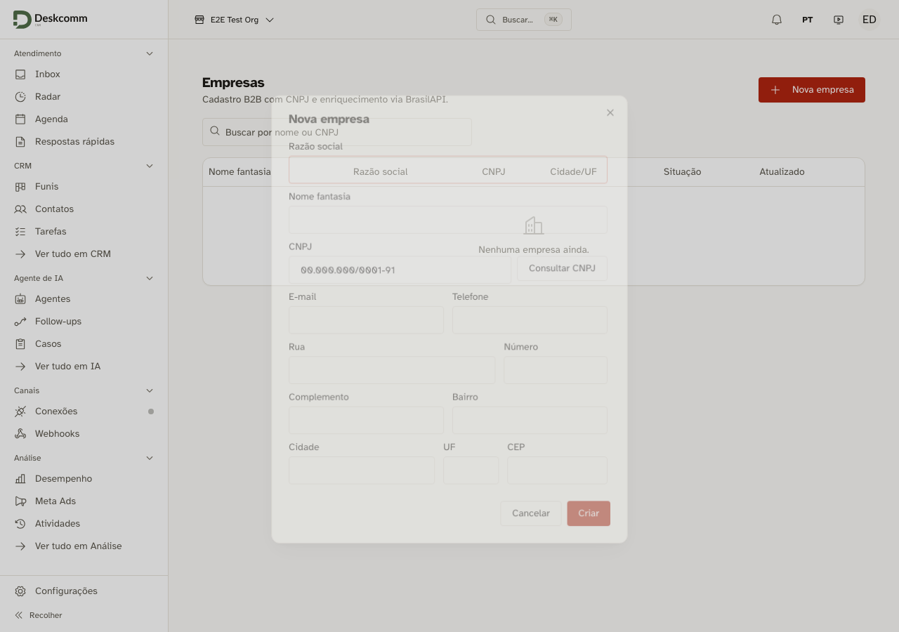
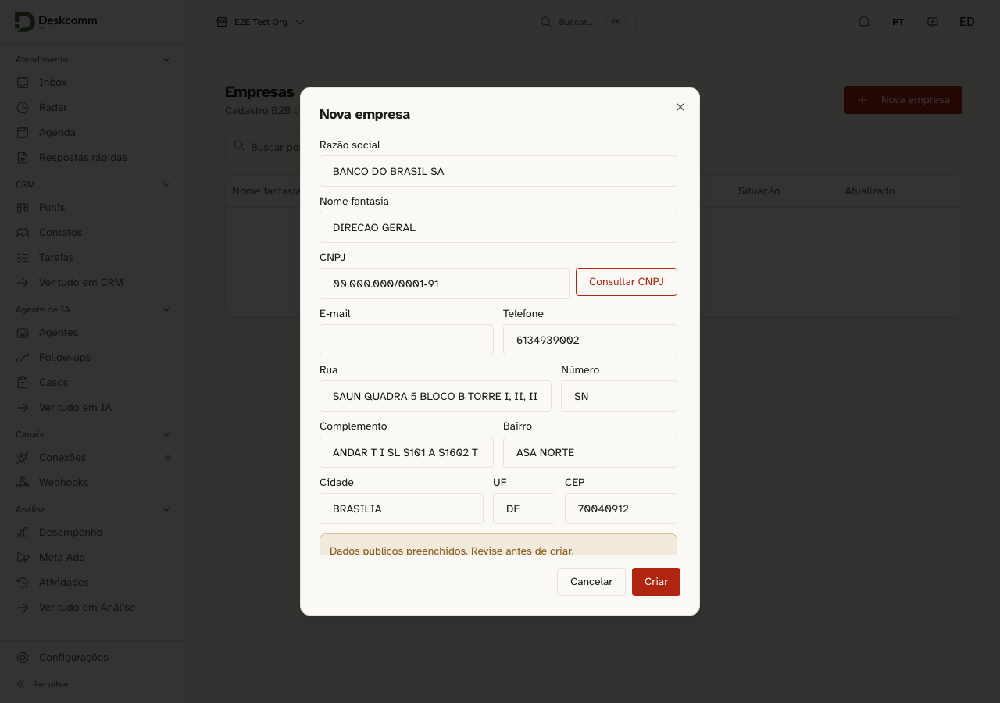

# Consulta de CNPJ — a BrasilAPI recusava o `User-Agent` padrão do Node

Prova pela tela (DoD 12) do conserto de `lib/brasil-api/client.ts`.

## O sintoma

Na tela **Empresas** (`/app/companies`), "Consultar CNPJ" devolvia sempre
_"Não foi possível consultar o CNPJ."_ — e, junto, a dica _"A BrasilAPI recusou a
consulta (403). Pode ser bloqueio temporário; tente de novo mais tarde."_

As duas frases mandavam para o lugar errado. A primeira é o **texto de reserva**
de `app/app/companies/_client.tsx:97`, que só aparece quando o erro real não
chega; a segunda afirmava "temporário" sobre algo que era permanente e
determinístico.

## A medição que isolou a causa

O `curl` daqui respondia 200 e o aplicativo respondia 403, na mesma máquina e no
mesmo minuto. A diferença não estava na rede nem no IP: estava no cabeçalho. O
cliente definia apenas `Accept: application/json`, e, quando o código não define
`User-Agent`, o `fetch` do Node 22 manda `User-Agent: node` sozinho. É esse valor
que a borda recusa.

Mesmo CNPJ (`00000000000191`), quatro variações (as duas primeiras saem do Node
com `User-Agent: node` — conferido depois com um servidor local que ecoa o
cabeçalho recebido):

```
403  fetch com { Accept } apenas        ← era exatamente o que daqui saía (UA: node)
403  fetch sem header nenhum            (UA: node)
200  fetch + User-Agent: curl/8.7.1
200  fetch + User-Agent próprio
```

Controle pelo outro lado, com `curl`:

```
200  curl padrão (manda User-Agent sozinho)
429  curl -H 'User-Agent:'  (cabeçalho esvaziado à força)
```

O `curl -H 'User-Agent:'` remove o cabeçalho, e a recusa veio como 429, não
403. Na triagem, medindo de novo, `User-Agent: node` foi recusado com 403 numa
rodada e 429 em outra; sem o cabeçalho ou com ele vazio, 429; com
`self-hosted-crm/1.0`, 200 em todas. A recusa vinha da borda que serve a
BrasilAPI (`id: gru1::…`; a resposta traz `server: cloudflare`), não do nosso
código nem da conta de ninguém. **Quebrava em toda instalação**, e nos três
caminhos que usam este cliente: o lookup do cadastro, o enriquecimento de
`lib/crm-b2b/enrich.ts` e a importação em lote de `lib/crm-b2b/import-process.ts`.

Reproduzido também pela rota, autenticado, antes do conserto:

```
GET /api/v1/companies/lookup?cnpj=00000000000191
HTTP 502  {"error":{"code":"upstream_error","message":"BrasilAPI respondeu 403."}}
```

## Depois, na tela

Abrindo **Nova empresa** e digitando o CNPJ:



Clicando em "Consultar CNPJ", o formulário inteiro é preenchido — razão social,
nome fantasia, telefone, endereço, bairro, cidade, UF e CEP — com o aviso "Dados
públicos preenchidos. Revise antes de criar.":



## Por que o `User-Agent` é neutro

Ele **não** reusa o `APP_USER_AGENT` de `lib/nuvemshop/config.ts`. Lá o nome do
produto tem linha na allowlist de marca porque identifica uma aplicação
**registrada** na plataforma da Nuvemshop; aqui não existe registro nenhum — a
BrasilAPI só recusa o valor padrão do Node (e a ausência). Mandar o nome da marca entregaria o
revendedor a um terceiro, variaria por instalação (deixando o tráfego justamente
inidentificável) e pediria linha nova numa allowlist que, por doutrina, só
encolhe.

## A cerca

`lib/brasil-api/client.test.ts`, novo — este cliente não tinha nenhum teste
co-locado. Ele não fixa o texto do cabeçalho, mas reprova os três valores que a
borda recusa: ausente (que o Node troca por `node`), vazio e o próprio `node`.
Trocar por outro valor é livre.

Provado com sabotagem: removendo o cabeçalho do cliente, `1 failed | 2 passed`
(`expected null to be truthy`); restaurando, `3 passed`. Na triagem, a sabotagem
foi repetida com `User-Agent: node` explícito, que a versão anterior da cerca
deixava passar — ver o comentário da triagem no PR.
