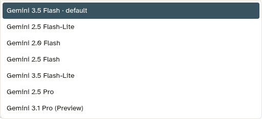

# Gemini 3.5 Flash-Lite no seletor Google

Em 06/10/2026, a instalação piloto Acquarela exibiu `Gemini 3.5 Flash-Lite` na lista do provedor Google da tela IA › Agentes › Modelo. A captura foi feita em um formulário não salvo; nenhum agente foi alterado ou publicado.

A lista é fornecida por `GET /api/v1/ai/providers/google/models`, que lê `ai_models` e só oferece modelos ativos com ferramentas. O catálogo foi preenchido com o identificador `gemini-3.5-flash-lite`, confirmado pela [documentação do Google](https://ai.google.dev/gemini-api/docs/models/gemini-3.5-flash-lite) e por uma consulta de metadados HTTP 200 com a credencial da organização, sem mostrar a chave.

A captura comprova a seleção. A elegibilidade para publicação foi conferida por leitura do predicado de `fn_publish_ai_agent_version` e do estado da credencial/canal; nenhuma publicação foi executada.
